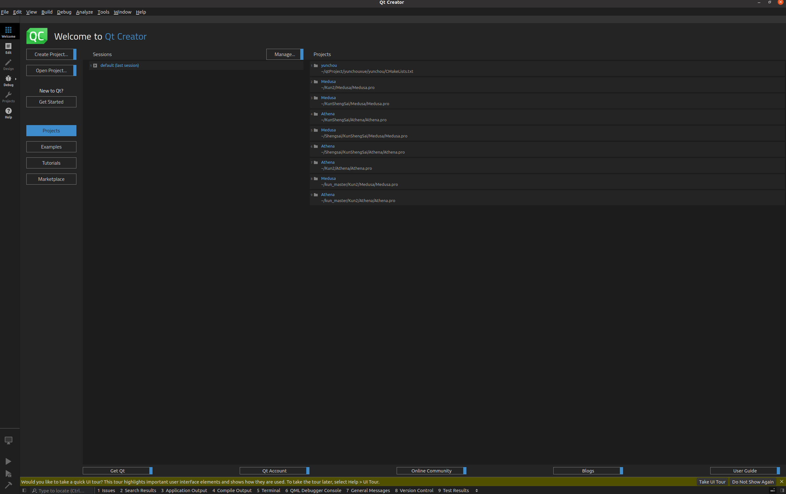
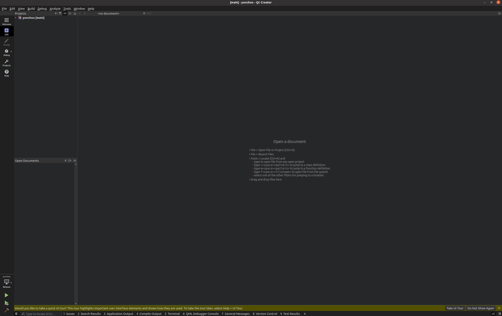
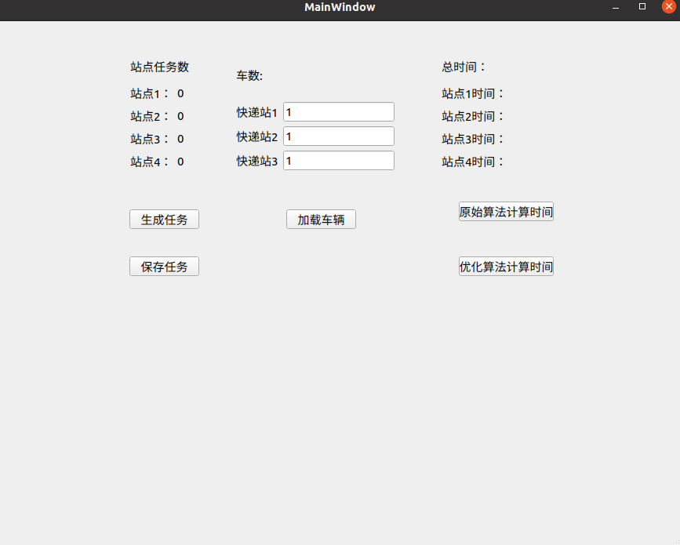

# 配置方法
推荐使用ubuntu
- 在电脑上下载git、qt creator
- 在目标文件夹（路径不要含有中文）执行下列指令 
`
git clone https://github.com/UnderValley/yunchouxue.git
`
- 之后打开qt creator出现以下界面

- 将yunchou文件夹直接拖入该界面，进入以下界面

- 点击左下角“yunchou”图标，选择“release”模式
- 点击锤子图标进行编译
- 编译后选择无debug模式的“Run”，可看到如下界面

- 说明配置完成了

# 代码说明
## worldmodule.h
目前只定义了一个枚举类型DES，为点的名称ABCD为目标站，EF
为快递站

## 需要用的类
car.h/cpp 定义了车类

recpos.h/cpp  定义了目标站点类

pos.h/cpp  快递站定义为此类

task.h/cpp  定义了任务类

## 其他
节点的连接通过neighbs模板容器变量定义，模板第一个参数为连接点，第二个参数为路程，未设置完毕

